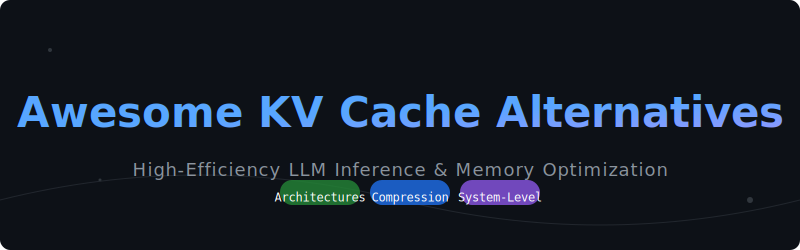

# Awesome KV Cache Alternatives 🚀

  
   
  

    
    
    
    
    
  

---

## 📖 Overview

Standard **Key-Value (KV) caching** is the backbone of Large Language Model (LLM) generation, speeding up inference by storing pre-computed attention states. However, as context lengths grow, the KV cache becomes a massive memory bottleneck—often leading to Out-Of-Memory (OOM) errors and limited batch sizes.

This repository is a curated list of modern **KV cache alternatives** and optimization techniques designed to scale LLM infrastructure by focusing on **architectural breakthroughs**, **algorithmic compression**, and **system-level disaggregation**.

---

## 🗺️ Table of Contents

- [1. Architectural Alternatives 🏗️](#1-architectural-alternatives-replacing-attention-🏗️)
- [2. Algorithmic Compression & Eviction 📉](#2-algorithmic-compression--eviction-📉)
- [3. System-Level Offloading & Disaggregation ⚙️](#3-system-level-offloading--disaggregation-⚙️)
- [Keywords & SEO 🔍](#keywords--seo-🔍)
- [Contributing 🤝](#contributing-🤝)

---

## 1. Architectural Alternatives (Replacing Attention) 🏗️
These architectures rethink the sequence modeling process to achieve linear or constant memory complexity, bypassing the quadratic growth of standard attention.

| Method | Description | Year | Paper Link |
| :--- | :--- | :--- | :--- |
| **State Space Models (SSMs)** | Frameworks like **Mamba** use selective state spaces to map sequences into recurrent operations, yielding $\mathcal{O}(1)$ memory complexity. | 2023 | [arXiv:2312.00752](https://arxiv.org/abs/2312.00752) |
| **Retention Networks (RetNet)** | Combines parallel training of transformers with low-cost inference using constant decay mechanisms. | 2023 | [arXiv:2307.08621](https://arxiv.org/abs/2307.08621) |
| **Multi-Head Latent Attention (MLA)** | Utilized in **DeepSeek-V3**, MLA compresses KV tensors into a shared latent space, shrinking the memory footprint significantly. | 2024 | [arXiv:2405.04434](https://arxiv.org/abs/2405.04434) |

---

## 2. Algorithmic Compression & Eviction 📉
Software-level techniques to compress, quantize, or selectively drop KV cache data without requiring new model architectures.

| Method | Description | Year | Paper Link |
| :--- | :--- | :--- | :--- |
| **Quantization (KIVI)** | Compresses KV tensors to 2-bit or 4-bit widths during inference, allowing for massive batch-size scaling. | 2024 | [arXiv:2402.02750](https://arxiv.org/abs/2402.02750) |
| **StreamingLLM (Attention Sinks)** | Maintains stable performance over infinite sequences by retaining only "attention sinks" and a sliding window of recent tokens. | 2023 | [arXiv:2309.17453](https://arxiv.org/abs/2309.17453) |
| **Prompt Caching** | Reuses pre-computed KV states for shared prefixes (system prompts, docs) across different user sessions. | 2023 | [arXiv:2311.04934](https://arxiv.org/abs/2311.04934) |
| **Depth-Dimension Merging (MiniCache)** | Exploits layer redundancy by merging KV caches across neighboring layers, reducing memory by up to 41%. | 2024 | [arXiv:2405.14313](https://arxiv.org/abs/2405.14313) |

---

## 3. System-Level Offloading & Disaggregation ⚙️
Infrastructure optimizations that manage how hardware handles the physical cache footprint to maximize throughput.

| Method | Description | Year | Paper Link |
| :--- | :--- | :--- | :--- |
| **PagedAttention (vLLM)** | Manages KV cache in non-contiguous memory blocks (virtual pages), eliminating fragmentation and enabling sharing. | 2023 | [arXiv:2309.06180](https://arxiv.org/abs/2309.06180) |
| **Distributed Caching (Mooncake, LMCache)** | Offloads cache storage from GPU VRAM to CPU RAM or NVMe tiers using a disaggregated management layer. | 2024 | [arXiv:2407.00079](https://arxiv.org/abs/2407.00079) |

---

## Keywords & SEO 🔍
To help researchers and engineers find these resources, this project focuses on:
`LLM Inference Optimization`, `KV Cache Compression`, `vLLM PagedAttention`, `Mamba SSM`, `DeepSeek MLA`, `Long-Context LLMs`, `Transformer Memory Bottleneck`, `Attention Sinks`, `Quantized KV Cache`.

## Contributing 🤝
Contributions are welcome! If you have a new paper or tool related to KV cache optimization, please open a PR.

---

  Built with ❤️ for the LLM Infrastructure community.

